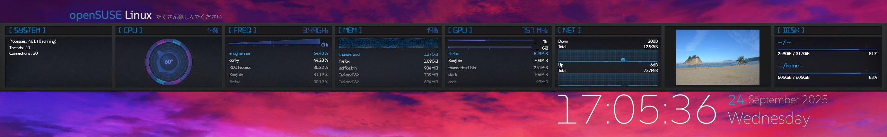
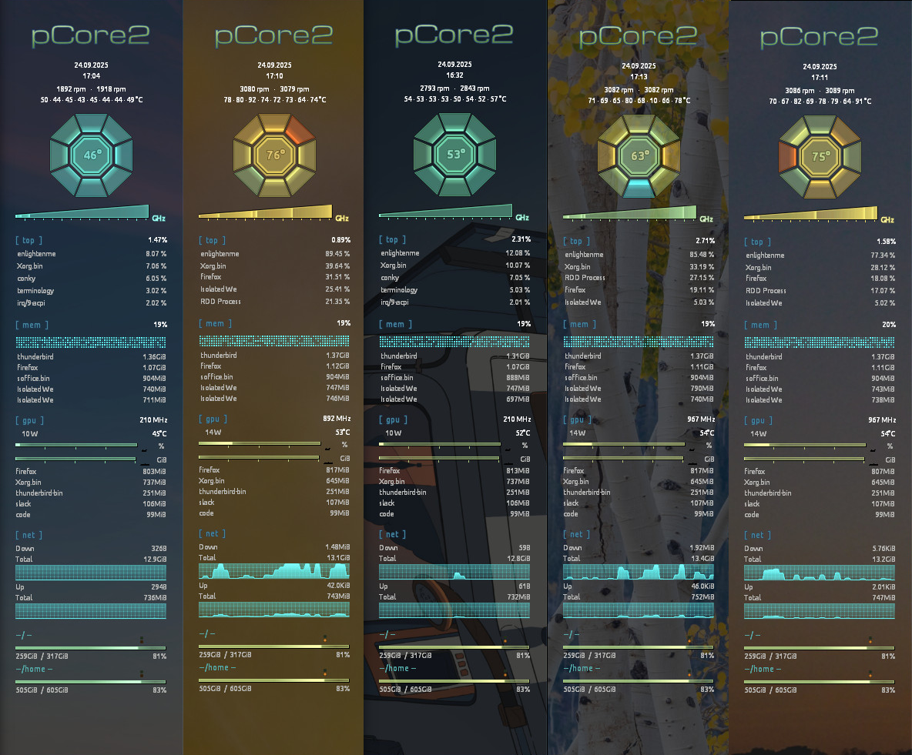

# Conky Bubbles

**Warning:** Currently this requires https://github.com/brndnmtthws/conky/pull/1501 to work correctly.

**Conky's Little Helper**

Conky bubbles aim's to create a set of good looking configs for conky that will work out of the box on a range of machines but are also easy to change if desired. It does this by auto detecting hardware (WIP), implementing a theme engine, a layout engine (no more manually moving everything up and down a few pixels at a time) and implementing a large library of widgets to cover common use cases. 

Conky Bubbles is based on a heavily modified version of [polycore](https://github.com/philer/polycore) many thanks to philer for the hard work they put into that project.

## Features

* Stylish replacements for conky's default bars and graphs
* Allows complex layouts with minimal effort
* Easy to extend

## Requirements

* conky 1.22+ (with Lua and cairo support)
* basic understanding of conky and Lua
* *optional:* `lm_sensors` to display CPU core temperature and fan rpm
* *optional:* `nvidia-smi` to display NVIDIA video card stats

## Getting started

### Usage

You can run any of the existing configs running the following command from the `conky-bubbles` directory.

* `conky -c dimensionsrc.lua`
* `conky -c pcore2rc.lua`

## Customisation

### Config

Unlike traditional conky config's with bubbles everything is rendered through lua rather then conky's traditional rendering system. As such `conkyrc.text` should remain blank.

This repo ships several different conky configs using the "bubbles" engine along with several other examples, to easily identify files that are designed to run with conky, all such files in this repo end with `*rc.lua` such as [dimensionsrc.lua](dimensionsrc.lua)

With the bubbles engine rc files contain several key parts
* Conky Config - Window manager, window and other conky settings
* Theme - Colors fonts etc
* Widgets - The building blocks to create everything the user sees

See a more detailed description of each below

#### Conky Config
To reduce the size of rc files some common settings that should be the same across all configs have been moved into separate files. General settings can be found in [src/config/core.lua](src/config/core.lua), currently there are specific settings for some window managers these can be found below
* Awesome WM [src/config/awesome.lua](src/config/awesome.lua) (Default)
* Enlightenment [src/config/enlightenment.lua](src/config/enlightenment.lua)

If needed these values can be overwritten in the `script_config` section.

#### Themes
Themes allow you to use the same widget layout with a different set of colors and fonts, available themes are stored in [src/themes](src/themes/) and can be set with the following line `current_theme = require('src/themes/dimensions')` examples of the themes can be seen below.

#### Widgets

The `widget` module provides a number of basic and specialized modules
as well as grouping and rendering facilities. Their basic usage is best
understood by inspecting the `bubbles.setup` function in `dimensionsrc.lua`. Modifying this function is also the easiest way to get started. More examples can be found in [examples](examples).

Unlike polycore it is recommended that you keep your config in one file although you could use multiple .lua files and include them.

Examples of the remake of the polycore theme

## Using Widgets

*See [simotek.github.io//modules/widget.html](https://simotek.github.io/conky-bubbles/modules/widget.html) for a full API reference.*

Widgets are rendered by a `widget.Renderer` instance and can have a cached background. A `widget.Rows` or `widget.Columns` instance can serve as root of a complex layout of nested widgets. 
It makes sense to combine this with normal conky text rendering - in fact some Widgets (e.g. `widget.Network` and `widget.Drive`) assume this.

A widget can have fixed or flexible height and width. Fixed means that
the widget's `:init` function sets the `.width`/`.height` property to an integer.
If the respective property is not defined (`nil`) the layout engine
will assign an automatic amount of space, split evenly between this and other flexible widgets.

The following Widget classes are currently available:
* **Core**
  * **`Widget`** the base class - Does nothing by itself.
* **Containers**
  * **`Stack`** Allows you to stack multiple widgets on top of each other
  * **`Float`** Place a Widget at a certain X, Y coordinate, can be useful with a `Stack` to layout widgets manually
  * **`Rows`** a container for multiple widgets to be rendered in a vertical stack - It can also be useful to subclass this in order to create composite widgets with a combined `:update()` (see the implementation of `Drive` as an example).
  * **`Columns`** like `Rows` but horizontal
  * **`Filler`** Leave some empty space. Can also wrap another widget to restrict its size.
  * **`Frame`** Provides background color, border, padding and margin for other Widgets.
  * **`Block`** Fancy Frame with Area for Title Widgets and Body Widgets, used as the main part of the Dimensions rc
* **Text**
  * **`StaticText`** Display unchanging text
  * **`ConkyText`** Display a line of text that can include conky variables and will be updated once per second. Is run through `conky_parse()`
  * **`TextLine`** Display a dynamic line of text.
* **Image**
  * **`StaticText`** Display an unchangeable image.
  * **`RandomImage`** Display a random image from a folder
* **Indicator**
  * **`Bar`** a basic bar similar to the one available in normal conky.
  * **`Graph`** a basic graph similar to the one available in normal conky.
  * **`LED`** a minimalistic indicator light with adjustable brightness and color.
* **CPU**
  * **`Cpu`** Polycore's polygon CPU, best with 4-8 Cores but can support more
  * **`CpuRound`** A round CPU usage indicator best suited for high core counts.
  * **`CpuCombo`** Merges CPU and CPU Round best for high core count's the default for the dimensions rc
  * **`CpuFrequencies`** Bar-like indicator of frequencies for individual cores
  * **`CpuTop`** Show processes currently using the CPU.
* **Drive**
  * **`Drive`** Bar plus temperature indicator for a HDD or SSD.
* **GPU**
  * **`Gpu`** Bars for GPU and VRAM usage - requires `nvidia-smi`
  * **`GpuTop`** Show processes currently using the CPU.
* **Memory**
  * **`MemoryBar`** a bar visualizing RAM usage.
  * **`MemoryGrid`** visualization of used (and buffered/cached) RAM in a randomized grid
  * **`CpuTop`** Show processes currently using the CPU.
* **`Network`**
  * **`Network`** Graphs for up- and download speed along with text

## Creating Widgets

In order to add your own Widget you should inherit the base class (`local MyWidget = util.class(widget.Widget)`). Look at `widget.lua` for examples.

The Widget API assumes the following functions. Note that only `:layout` is required.

* **`MyWidget:init(…)`** Your widget's constructor. It can set fixed `.width`/`.height` properties (see above).
* **`MyWidget:layout(width, height)`** This function will be called with arguments specifying the assigned space. If fixed `.width` and/or `.height` were specified the given arguments will be *at least* that value but may be greater.
*Note: For container Widgets this function must return a table of its children with relative coordinates and sizes. See the implementations of `Columns` and `Frame`.*
* **`MyWidget:render_background(cr)`** Allows you to draw some static background. This function will be called once at startup and again if the layout changes.
* **`MyWidget:update(update_count)`** Called once per update before `:render` with the value of conky's `${updates}` variable. Here you can fetch new data to update the information visualized by your widget.
If your widget's size has changed this function should return `true` to trigger a layout reflow.
* **`MyWidget:render(cr)`** Allows you to draw dynamic content once per update.

You can also create composite Widgets by subclassing `Rows` or `Columns`. See `Drive` as an example.
